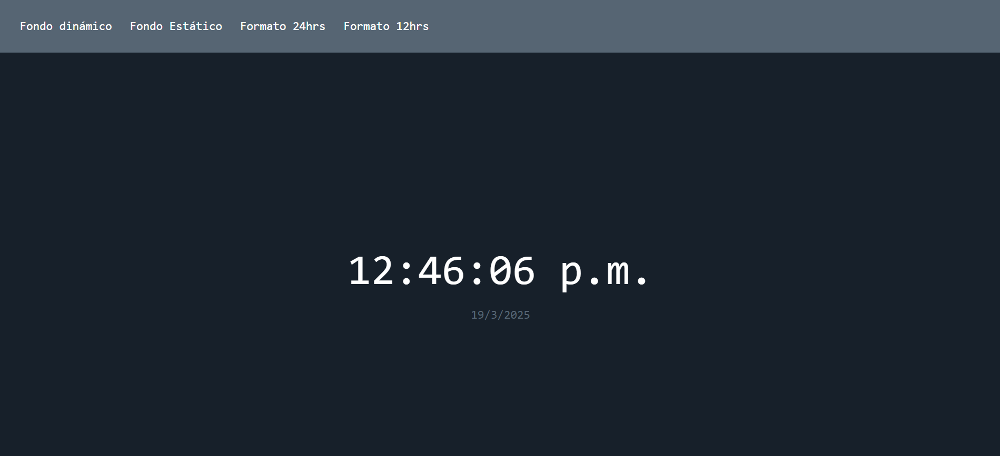

# Reloj Digital con Cambio de Colores

Un reloj interactivo que cambia entre formatos 12h/24h y cicla colores de fondo.

## Características
- Muestra hora y fecha actual.
- Botones para formato 12h/24h.
- Fondo dinámico con 5 colores predefinidos.

## Cómo Usar
1. Clona el repositorio.
2. Abre `index.html` en tu navegador.
3. Usa los botones para interactuar.

## Tecnologías
- HTML
- CSS
- JavaScript

## 📜 Licencia
Este proyecto está bajo la licencia MIT. Para más detalles, consulta el archivo [LICENSE](LICENSE).